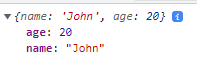

## Arelia Maia
----------------------
**Writing Assignment**
======================
### ~ Minggu 2 ~
----------------------
----------------------

## Materi :

-  **SCOPE**
-  **FUNCTION**
-  **OBJECT**
-  **DOM**
-  **ARRAY**

---

____

 

# **SCOPE** 

*Daya Jangkau suatu variable.*

---

### **Blocks** adalah kode yang berada dalam curly braces { }

---

## **Ada 2 scope** :

1. *Global scope*
2. *Local scope*

## - Global Scope                                                           
- Variable dapat diakses dimanapun.                                        
- Variable berada di luar blocks.                                        

## - Local Scope 
- Variable hanya bisa diakses dalam blocks  
- Variable berada di dalam blocks.

----------------------
---

 

# **FUNCTION** 

*Blok kode yang digunakan untuk menyelesaikan satu task.*

---

### **Membuat Function** :

---

- Identifier:

        nama fungsi 

- Parameter Function:

        menerima sebuah input dan akan digunakan untuk melakukan task

- Argumen Function:

        - nilai yang digunakan saat memanggil function 
        - jumlah argumen harus sama dengan jumlah parameter

- Return:

        membalikkan suatu nilai

---

### **Default Parameter** :

---

    memberikan nilai awal pada parameter function

**Contoh:**

    menjaga function agar tidak error saat dipanggil tanpa argumen.

---

### **Function Helper** :

---

*menggunakan function yang sudah dibuat di function lain*

**Contoh Penerapan:**

---

        function LuasPersegiPanjang(p, l){
                return p * l;
        };

        function VolumePersegiPanjang(p, l, t) {
                return LuasPersegiPanjang(p, l) * t;
        };

### **Arrow Function** :

---

*versi singkat suatu function*

**Contoh Penerapan:**

---

        const CelciusToFahrenheit = (celcius) => {
                return celcius * (9 / 5) + 32;
        };

 

---

# **OBJECT** 

*Data type yang dapat menampung banyak nilai.*

---

### **Membuat Object**

Note : Gunakan single quote ('') pada key atau properti jika menggunakan spasi 

contoh : `'Asal Sekolah' : "Surakarta"`

---

### *Melihat atau mengakses semua isi Object*

`console.log(person);`

~~Hasilnya :~~

### **Mengakses Nilai properti pada Object dan Update Object**
1. *Dot Notation ( . )*
2. *Bracket Notation ( [] )*

---

### **Mengakses Nilai Setiap Property**

---

#### *Dot Notation* 

---

**Syntax :**

**Contoh Penerapan :**

`console.log(person.name);`

`console.log(person.age);`

---

#### *Bracket Notation*

---

**Syntax :**

**Contoh Penerapan :**

`console.log(person['name']);`

`console.log(person['age']);`

---

### **Update Object**

---

#### *Dot Notation* 

---

**Syntax :**

**Contoh Penerapan :**

`person.hoby = "memasak";`

---

*hasil:*

**sebelum :**                      

**sesudah :**

---

#### *Bracket Notation*

---

**Syntax :**

**Contoh Penerapan :**

`person['asal'] = "Solo";`

---

*hasil:*

**sebelum :**                      

**sesudah :**

---

### **Update Object Dengan Membuat Variable Baru**

---

**Syntax :**

**Contoh Penerapan :**

`let new1 = "Warna Favorit";`

`person[new1] = "Ungu";`

---

*hasil:*

**sebelum :**                      

**sesudah :**

---

### **Nested Object**

---

*Object dalam Object*

---

### **Contoh Nested Object**

---

### **Mengakses Nilai Property Object**

---

1. *Dot Notation*

**Contoh :**

2. *Bracket Notation*

**Contoh :**

**Hasil :**

---

### **Menambahkan Nilai Property Object**

---

1. *Dot Notation*

**Contoh :**

`person.alamat.newAddress = "Jogja";`

2. *Bracket Notation*

**Contoh :**

`person['alamat']['newAddress2'] = "Sragen";`

**Hasil :**

---

### **Menghapus Nilai Property Object**

____

    menggunakan delete

**Contoh:**

---

### **Method**

____

    Value yang dimasukkan pada property berupa function

**Contoh:**

---

### **Looping Object**

        menampilkan seluruh object property tanpa mengakses secara manual tiap property.
____

**Contoh:**

---

### **Array of Object**

       Array of Object digunakan untuk data lebih dari satu
____

**Contoh:**

---

 

# **DOM** 

---

Memanipulasi Tampilan Web 

---

### **Mencari Element HTML**

---

1. *Mencari Element dengan Id tertentu*

`document.getElementById("siswa");`

2. *Mencari Element dengan Class tertentu*

`document.getElementByClassName("murid");`

3. *Mencari element dengan selector*

`document.querySelector("#siswa");`

---

### **Mengubah Konten Element HTML**

---

1.  *textContent*

- Element.textContent => Mengubah atau menambahkan teks di dalam element

`document.getElementById("title").textContent = "Perkenalan"`

2. *innerHTML*

-  Element.innerHTML => Mengubah dan menambahkan konten di dalam element

`document.getElementById("title").innerHTML = "titleNew"`

---

### **Membuat Element HTML**

---

*Langkah:*

1. .createElement()

`const judul= document.createElement("h2")`

2. .textContent

`judul.textContent = "Ini Judul"`

3. .appenChild()

`document.getElementById("header").appenChild(judul)`

---

### **Events**

---

*Interaksi User*

---

### ***Menangkap Interaksi User***

---

1. EventListener

Element.addEventListener("event")

- EventListener - Click

*menampilkan suatu pemberitahuan ketika melakukan click pada element*

        - contoh :

        Langkah 1:

                const input = document.getElementById("username")
                const button = document.getElementById("tom-button")

        Langkah 2:

                button.addEventListener("click", function(){
                        alert (input.value)
                })

        Cara Lain :

                button.onclick = function() { alert(input.value) }

- EventListener - Blur

*event di mana sebuah element kehilangan fokus dari user*

- EventListener - Form Submission

*event untuk mendapatkan isi dari kedua input tersebut saat submit form*

---

 

# **ARRAY** 

---

*type data yang dapat menyimpan semua type data (string, number, boolean, dll)*

        - Array didefinisikan dengan square brackets []
        - Array dihitung dari index data ke 0

**Contoh:**

___

**Update Array:**

---

**Contoh:**

*hasil:*

___

**Const in Array:**

---

        - Penguunaan Const tidak dapat melakukan update data, tetapi dapat melakukan update konten nilai di dalam array (mutable).
        - Tidak bisa mengubah array dengan array yang baru jika menggunakan const

___

**Array Properties**

---

*Ada 5 Properties yang sering digunakan:*

1. Constructor, mengembalikan fungsi yang membuat prototype object array
2. Length, mengembalikan nilai dari jumlah panjang data suatu array
3. Index, mencari array untuk element 
4. Input
5. Prototype, menambahkan property dan method ke object array

___

**Array Method ( Built in Methods )**

---

1. .push()

        method untuk menambahkan item  array pada urutan yang paling akhir.

2. .pop()

       method yang menghapus item array index terakhir.

3. .shift() 

        method untuk menghapus item Array pada index pertama

4. .unshift() 

        method untuk menambahkan item Array pada index pertama

5. .sort() 

        method untuk mengurutkan secara Ascending atau Descending Alphanumeric

___

**Looping pada Array**

---

1. .forEach()

        - method untuk melakukan looping pada setiap elemen array dan menyimpan ke database
        - tidak dapat membuat array baru

2. .map()

        melakukan perulangan/looping dengan membuat array baru ( melakukan operasi pada array sehingga dapat mengubah nilai array sebelumnya )

